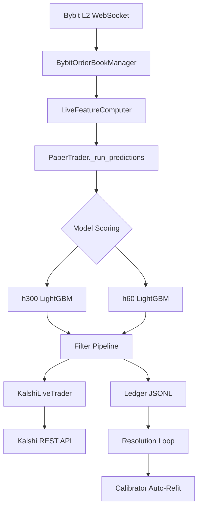

# Model A v3 — Codebase Audit Report

**Date:** 2026-05-09  
**Baseline:** `h300 BTC 900s` (golden goose — preserved)  
**VPS:** `34.67.75.48` / container `h300-retrain-shifted-v2-clone`

---

## 1. Current Architecture Summary



**Key files:**

| Component | Path | Size |
|---|---|---|
| Paper trader (main loop) | `trading/paper_trader.py` | 1,388 lines |
| Live feature computation | `trading/live_features.py` | 600 lines |
| Ledger (JSONL storage) | `trading/ledger.py` | 283 lines |
| Kalshi live trader | `execution/kalshi_live_trader.py` | 751 lines |
| Calibration | `execution/calibration.py` | 272 lines |
| Training pipeline | `validation/run_training.py` | 706 lines |
| V3 retrain (debiased) | `validation/retrain_v3.py` | 450 lines |
| Config | `config.py` | 205 lines |
| Kline downloader | `data/download_klines.py` | 167 lines |
| L2 orderbook downloader | `data/download_orderbook.py` | 230 lines |
| Feature builder (v1) | `data/build_features.py` | 381 lines |
| Feature enrichment (v3) | `data/build_features_v3.py` | 297 lines |

---

## 2. Storage Findings

### 2.1 Current JSONL Structure

**Predictions file** (`predictions_{model}.jsonl`): Two record types per prediction:
- `prediction` — logged at model scoring time (features, proba, direction, metadata)
- `resolution` — logged ~15 min later (close price, correct/incorrect)

**Paper trades file** (`paper_trades_{model}.jsonl`): Two record types per trade:
- `trade_entry` — logged when a trade passes filters (or is suppressed with reason)
- `trade_resolution` — logged when the contract expires (PnL, result)

**Kalshi ledger** (`kalshi_orders.jsonl`): One record per live gate decision.

### 2.2 Current File Sizes (Live VPS)

| File | Lines | Disk |
|---|---|---|
| `predictions_h300.jsonl` | 15,282 | ~5 MB |
| `predictions_h60.jsonl` | 15,644 | ~5 MB |
| `paper_trades_h300.jsonl` | 3,098 | ~2 MB |
| `paper_trades_h60.jsonl` | 2,906 | ~2 MB |
| `kalshi_orders.jsonl` | 407 | 192 KB |
| `calibration_outcomes.jsonl` | 616 | 48 KB |
| **Total logs dir** | — | **29 MB** |

### 2.3 Scaling Assessment

> [!WARNING]
> **JSONL will become painful at scale, but is NOT yet a bottleneck.**

At ~30 MB after ~2 weeks of dual-model trading, the current growth rate is ~2 MB/day. A year of operation would produce ~730 MB of JSONL — manageable, but:

- **Query performance degrades linearly.** Every calibration analysis, weekly report, or dashboard query scans the entire file.
- **No indexing.** Finding "all h300 BTC trades on 2026-05-07" requires reading every line.
- **Features embedded in predictions** inflate file size ~3× (the `features` dict is ~800 bytes per prediction record).
- **Merge-by-ID is O(n²)** in `merge_predictions_with_resolutions()` — works fine at 15K records, fails at 500K.

### 2.4 Kline Resolution

- **Current base resolution:** 1-minute klines from Bybit REST (`download_klines.py`, `interval="1"`).
- **Per-minute kline storage:** Already implemented. The v3 features pipeline aggregates 1-second L2 data to 1-minute bars. Kline data is stored as daily Parquet files per symbol.
- **Feasibility:** At ~1,440 bars/day × 4 symbols × 365 days = ~2.1M rows/year. Parquet handles this trivially (~50 MB/year compressed).

### 2.5 Storage Recommendation

> [!TIP]
> **SQLite for trade/prediction logs. Parquet stays for features.**

| Data Type | Current | Recommended | Why |
|---|---|---|---|
| Predictions | JSONL | **SQLite** | Indexed queries by model, symbol, date, direction |
| Paper trades | JSONL | **SQLite** | Same — plus JOIN on prediction_id |
| Kalshi orders | JSONL | **SQLite** | Small volume, but needs indexed lookups |
| Calibration outcomes | JSONL | **SQLite table** | Auto-refit needs aggregation by bin |
| Feature parquets | Parquet | **Parquet** (keep) | Columnar format perfect for training pipelines |
| Kline data | Parquet | **Parquet** (keep) | Same reasoning |

TimescaleDB is overkill for this volume. SQLite gives indexed queries, `GROUP BY` calibration analysis, and zero operational overhead (no daemon, no config, single file backup).

---

## 3. Prediction and Trade Resolution Findings

### 3.1 Orphan Audit Results (Live VPS, 2026-05-09)

| Model | Entry Type | Entries | Resolutions | **Orphaned** |
|---|---|---|---|---|
| h300 | Predictions | 7,692 | 7,003 | **689** |
| h300 | Trades | 2,486 | 612 | **1,874** |
| h60 | Predictions | 7,692 | 6,988 | **704** |
| h60 | Trades | 1,932 | 974 | **958** |

### 3.2 Root Cause Analysis

**Prediction orphans (~700 per model):** These are the most recent ~700 predictions that haven't reached their 15-minute resolution window yet. This is **expected and healthy** — the pending resolution queue is working correctly.

**Trade orphans — H300 has 1,874 orphaned trades:** Of these, **1,872 are suppressed entries** (trades that were logged with a `suppressed_reason` like `below_confidence`, `contract_mismatch`, `non_15m_boundary`, or `utc_blackout`). Suppressed trades are **deliberately never scheduled for resolution** — they exist only for post-hoc analysis. The remaining 2 orphans are likely in-flight pending resolutions.

> [!NOTE]
> **No resolution bug found.** The orphan counts are explained by design: suppressed trades don't get resolutions, and recent predictions haven't expired yet. The system is resolving correctly.

### 3.3 Resolution Timing Concern

All predictions resolve at `boundary_ms + 900_000` (15 minutes), regardless of model. This means:
- **H60 predictions resolve on a 900s window**, not a 60s window.
- This is **intentional for the current system** (Kalshi contracts are 15-minute), but creates a mismatch if H60 is meant to predict 60-second price movements.

> [!IMPORTANT]
> **For v3:** If you add models with different horizons, each model's resolution timer MUST match its training horizon, not a fixed 900s.

### 3.4 Calibration Map Concern

The live calibration map shows:
```
raw 0.52 → calibrated 0.4632  (136 samples, 63 wins = 46.3%)
raw 0.53 → calibrated 0.5098  (51 samples, 26 wins = 51.0%)
raw 0.54 → calibrated 0.75    (20 samples, 15 wins = 75.0%)
```

The `0.54 → 0.75` bin has only 20 samples — this is a **dangerously overfit calibration point**. The auto-refit triggers at `MIN_REFIT_SAMPLES = 30` total but only requires `MIN_SAMPLES_PER_BIN = 5` per bin. This means extreme bins with 5–20 samples can distort Kelly sizing dramatically.

---

## 4. Data Pipeline Findings

### 4.1 Download Pipeline

Two separate downloaders exist:
- `data/download_klines.py` — Bybit REST kline data (1-min OHLCV)
- `data/download_orderbook.py` — Bybit S3 L2 orderbook ZIPs

Both are **manual CLI scripts**. There is **no automated retrain pipeline** that chains: download → build_features → build_features_v3 → run_training → deploy.

### 4.2 Gap Handling

- `download_klines.py`: **Skips if output file exists** (`if output_path.exists()`). This means if a partial download was saved, it's treated as complete. No gap detection.
- `download_orderbook.py`: Same skip-if-exists pattern. No checksum or row-count validation.
- Neither script logs what date ranges are missing.

### 4.3 Retrain Window Integrity

The training pipeline (`run_training.py`) has **hardcoded split dates**:
```python
TRAIN_END = "2025-12-31"
VAL_END = "2026-02-15"
```

There is no mechanism to:
1. Automatically extend the training window to include new data
2. Detect if downloaded data covers the full training window
3. Validate continuity (no missing days)
4. Handle partial days or duplicate data

> [!WARNING]
> **Critical for v3:** The retrain pipeline must be parameterized by date range and must validate data completeness before training begins.

### 4.4 Feature Pipeline Chain

```
L2 Parquet → build_features.py (v1: 1s bars) → add_rolling_features.py (v2)
         → build_features_v3.py (enrichment + 1-min agg) → run_training.py
```

This chain works correctly but is **4 separate manual invocations**. For v3 with periodic retraining, this must be a single orchestrated pipeline.

---

## 5. Network and Inference Efficiency

### 5.1 Prediction Generation

Models are scored **serially** in `_run_predictions()` (line 700):
```python
for symbol in PREDICTION_SYMBOLS:    # 3 symbols
    for model_name, model in self.models.items():    # 2-3 models
        # score one at a time
```

Each `model.predict()` call is a single-row inference: `feature_vec.reshape(1, -1)`. This is the minimum-latency approach for a single prediction but **does not batch**.

### 5.2 Latency Profile

- Feature computation: O(1) per book update (in-memory rolling state)
- Model scoring: ~0.1ms per LightGBM predict (negligible)
- Kalshi ticker resolution: up to **64 seconds** (16 retries × 4s) due to Kalshi rollover lag
- Kalshi orderbook fetch: up to **10 seconds** (5 retries × 2s) for empty books

### 5.3 Multi-Model Scalability

The current architecture can support ~10 models per boundary without latency issues (LightGBM is fast). The bottleneck is the **Kalshi ticker resolution** (1 market lookup per boundary) and the **serial symbol loop**.

> [!TIP]
> **For v3:** Batch all symbol×model scoring into a single vectorized predict call per model. This changes `predict(1×N)` to `predict(S×N)` where S = number of symbols.

---

## 6. Polymarket / Kalshi Integration Status

### 6.1 Kalshi — Production Ready ✅

- Full RSA auth (`api/kalshi.py`, 456 lines)
- REST client with market discovery, orderbook, order placement
- Maker-first strategy with taker fallback
- Fee-aware Kelly sizing
- Auto-recalibration from live outcomes
- Config persisted to `/data/kalshi.env`

**Default-off enforcement:** `KALSHI_LIVE_ENABLED` defaults to `false` and must be explicitly enabled. The kill switch is memory-only on restart.

### 6.2 Polymarket — Read-Only, No Execution ❌

**What exists:**
- `api/polymarket.py` (70 lines) — CLOB order book reader + fee rate query
- `trading/polymarket_discovery.py` (165 lines) — Contract slug discovery, Gamma API lookup, CLOB midpoint
- `p_market` is fetched at every boundary and used for Kelly sizing divergence

**What is missing:**
- **No order placement.** There is no `place_order()` function for Polymarket.
- **No wallet/auth integration.** Polymarket CLOB v2 requires an Ethereum wallet + ECDSA signing. None of this is implemented.
- **No sandbox/testnet.** Polymarket does not offer a testnet. The only testing path is a small live bet.
- **No settlement handling.** Polymarket settles in USDC on Polygon. No withdrawal or position management code exists.

> [!IMPORTANT]
> Polymarket integration is ~20% complete (price discovery only). Building a full execution layer is a **separate workstream** that should not block v3.

---

## 7. Overlap Analysis Findings

### 7.1 Current State

There is **no overlap tracking** between models. H300 and H60 both score at the same 5-minute boundary, both log to separate ledgers, but there is no record of whether they agreed or disagreed on direction.

### 7.2 What's Available

Both models produce predictions at the same `boundary_ms` for the same `symbol`. The `prediction_id` is unique per model, but the `ts_contract_open_ms` is shared. This means overlap can be reconstructed offline by joining on `(ts_contract_open_ms, symbol)`.

### 7.3 Recommendation

**Log overlap at prediction time.** In `_run_predictions()`, after scoring all models for a symbol, add an `agreement` field to each prediction record:

```python
agreement = {
    "models_scored": ["h300", "h60"],
    "directions": {"h300": "down", "h60": "up"},
    "consensus": False,
    "max_confidence": 0.54,
    "mean_confidence": 0.52,
}
```

**Best location:** After the inner model loop completes for each symbol (line ~953 in paper_trader.py), compute cross-model agreement and append to each prediction's record.

---

## 8. Regime Detection Readiness

### 8.1 Available Internal Features

The following regime-relevant signals are **already computed** in `LiveFeatureComputer`:

| Signal | Source | Regime Interpretation |
|---|---|---|
| `relative_spread` | L2 book | Liquidity regime (tight vs wide) |
| `spread_5m_pct` | 5-min rolling | Spread regime percentile |
| `mlofi_60s_std` | Rolling std | Order flow volatility |
| `ofi_60s_std` | Rolling std | Same, aggregate flow |
| `vwap_dev_30s_std` | Rolling std | Price volatility proxy |
| `roll` | Roll measure | Realized bid-ask bounce |
| `mlofi_momentum` | 30s - 60s mean | Flow trend direction |
| `vwap_2m_deviation` | 2-min mean deviation | Short-term momentum |

### 8.2 Practical Regime Signals

From the existing features, the following regime classifiers can be derived without external data:

1. **Volatility regime** (low/medium/high): `vwap_dev_30s_std` + `mlofi_60s_std` quartiles
2. **Liquidity regime** (thin/normal/deep): `relative_spread` + `spread_5m_pct` quartiles
3. **Trend regime** (trending/mean-reverting/choppy): `mlofi_momentum` + `vwap_2m_deviation` sign persistence

### 8.3 Architecture Readiness

The current architecture **cannot** support regime-tagged predictions or regime-based calibration:
- Predictions are logged with raw features but no regime label
- Calibration is a single global bin map — no per-regime calibration
- No regime classifier exists (no training data for regime labels)

> [!TIP]
> **For v3:** Add a `regime_tag` field to every prediction record. Compute it from the feature vector at prediction time using simple quartile thresholds. This enables regime-stratified calibration later without requiring a separate regime model.

---

## 9. Model Versioning Recommendation

### 9.1 Current Convention

Models are named by horizon shorthand: `h300`, `h60`, `h60_v3`. The symlink pattern is `latest_h{horizon}` → `run_{timestamp}/`. Feature names are stored in `feature_names.json` alongside `model.lgb`.

### 9.2 Proposed Convention

```
{horizon}s_{symbol}_{feature_version}_{train_cutoff}
```

**Examples:**
| Current | Proposed | Meaning |
|---|---|---|
| `h300` | `900s_btc_v3_20260315` | 900s horizon, BTC, v3 features, trained through 2026-03-15 |
| `h60` | `60s_btc_v3_20260315` | 60s horizon, BTC, v3 features, trained through 2026-03-15 |
| `h60_v3` | `60s_btc_v3d_20260315` | 60s, BTC, v3-debiased, trained through 2026-03-15 |

**Rules:**
- Horizon in seconds (not "h300" ambiguity — is that 300 bars or 300 seconds?)
- Symbol explicitly named (enables multi-symbol models later)
- Feature version tracks schema changes (`v3`, `v3d` for debiased)
- Train cutoff date enables drift comparison (retrain on May data → `_20260509`)
- The **golden baseline** is always: `900s_btc_v3_20260315` (current production h300)

---

## 10. Risks and Blockers

| # | Risk | Severity | Impact |
|---|---|---|---|
| 1 | **No automated retrain pipeline** — download, featurize, train, deploy are all manual | 🔴 High | Retraining is error-prone and slow |
| 2 | **Hardcoded split dates** in training scripts | 🔴 High | Every retrain requires code edits |
| 3 | **Calibration overfit** — `0.54 → 0.75` on 20 samples | 🟡 Medium | Distorts live Kelly sizing |
| 4 | **JSONL scaling** — linear scan for every query | 🟡 Medium | Dashboard and reports slow down over months |
| 5 | **H60 resolves at 900s** regardless of its training horizon | 🟡 Medium | Win-rate analysis is for 900s window, not 60s |
| 6 | **No regime tagging** — can't diagnose why model fails in specific market conditions | 🟡 Medium | Can't do regime-stratified calibration |
| 7 | **No overlap logging** — model agreement not tracked | 🟢 Low | Missing signal for ensemble confidence |
| 8 | **Polymarket execution missing** — read-only integration | 🟢 Low | Not needed for v3 launch |

---

## 11. Recommended Next Steps (Pre-v3)

1. **Parameterize training dates** — Remove hardcoded `TRAIN_END`/`VAL_END` from `run_training.py` and `retrain_v3.py`. Accept them as CLI args.
2. **Add data completeness validation** — Before training, verify no missing days in the feature parquet directory for the requested date range.
3. **Increase `MIN_SAMPLES_PER_BIN`** — Change from 5 to 20 in `calibration.py` to prevent overfit on extreme bins.
4. **Add regime tags to predictions** — Compute volatility/liquidity quartiles at prediction time, log as `regime_vol` and `regime_liq` fields.
5. **Add model agreement field** — After scoring all models for a symbol, log consensus direction and confidence spread.
6. **Plan SQLite migration** — Design schema for predictions + trades tables with proper indexes. Can coexist with JSONL initially (write both).
